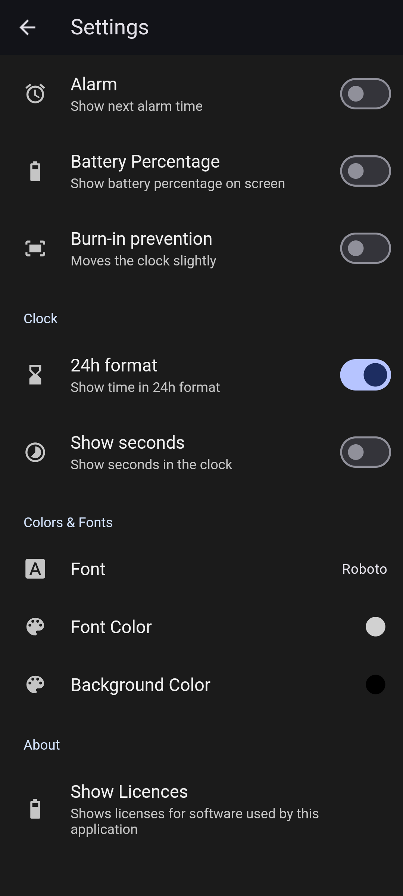
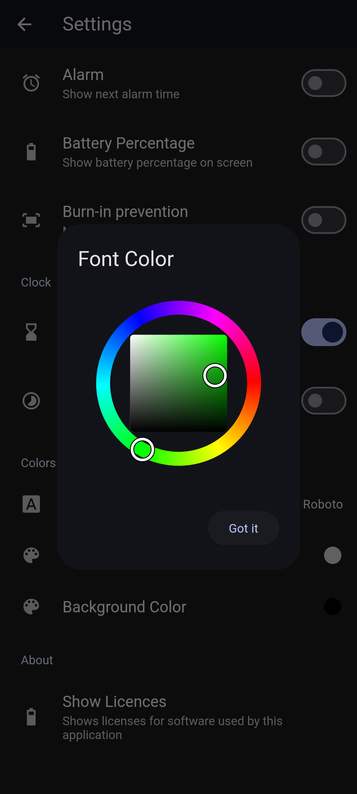
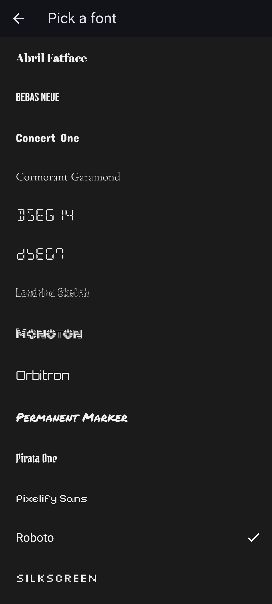

# DreamClock

A daydream screen saver showing a clock, created with Flutter.
This app is using the Android Daydream Service.

Once you installed the app, you should be able to enabled it in your OS settings
(normally at "Display & touch" > "Screen saver").

## Screenshots


[](docs/screenshots/flutter_0.png)
[](docs/screenshots/flutter_1.png)
[](docs/screenshots/flutter_2.png)
[](docs/screenshots/flutter_3.png)

## Development

```bash
flutter clean
flutter build apk
flutter install
```
